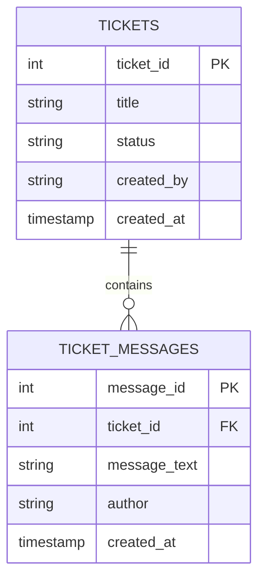

# Databricks AI Bootcamp

## Day 1 — Lakebase-Powered AI Support App

This repository contains the projects developed during the Databricks AI Bootcamp. It is designed to document the learning process, keep the source code reproducible, and provide enough context for future human collaborators and AI agents to understand the project before making changes.

## Project status

- Repository: configured and connected to a Databricks Git folder.
- Current phase: Day 1 homework.
- Implementation status: not started.
- Target runtime: Databricks Free Edition.
- Main platform components: Lakebase, Databricks Apps, Databricks Git folders, and notebooks.

## Bootcamp context

The bootcamp progresses through three connected themes:

1. **Lakebase and applications** — build an application with operational data stored in managed PostgreSQL.
2. **Context engineering and vector search** — prepare unstructured data and retrieve relevant context for AI applications.
3. **AI agents** — connect structured data, retrieved context, tools, instructions, and evaluation into an end-to-end application.

The Day 1 application is intentionally simple. It establishes the data and application foundation that will be extended in the later homeworks and in the capstone project.

## Day 1 homework objective

Build and deploy an internal support-ticket application backed by Lakebase.

The application must allow a user to:

- View all support tickets;
- Select a ticket and view its messages;
- Create a new ticket;
- Add a message to an existing ticket;
- Update a ticket's status;
- Refresh the application while preserving the data.

Hard-coded application data is not acceptable. Tickets and messages must be read from and written to Lakebase.

## Required data model

### `tickets`

| Column | Purpose |
|---|---|
| `ticket_id` | Primary key for the ticket |
| `title` | Short description of the issue |
| `status` | Current workflow status, such as `open`, `in_progress`, or `resolved` |
| `created_by` | User who created the ticket |
| `created_at` | Creation timestamp |

### `ticket_messages`

| Column | Purpose |
|---|---|
| `message_id` | Primary key for the message |
| `ticket_id` | Foreign key referencing `tickets.ticket_id` |
| `message_text` | Message content |
| `author` | User who wrote the message |
| `created_at` | Creation timestamp |

The database must contain at least three tickets, at least two messages for each ticket, and at least two different ticket statuses.



## Repository structure

The repository is organized as a monorepo so that the three homeworks and the capstone can evolve together without requiring a new Git folder for every project.

```text
databricks-ai-bootcamp/
├── homeworks/
│   ├── day-1-lakebase-support-app/
│   │   ├── app.py
│   │   ├── lakebase.py
│   │   ├── schema.sql
│   │   ├── seed.sql
│   │   ├── requirements.txt
│   │   ├── app.yaml
│   │   └── README.md
│   ├── day-2-context-engineering/
│   │   ├── notebooks/
│   │   ├── src/
│   │   └── README.md
│   └── day-3-agent-bricks/
│       ├── notebooks/
│       ├── src/
│       └── README.md
├── capstone/
│   ├── app/
│   ├── notebooks/
│   ├── pipelines/
│   ├── sql/
│   └── README.md
├── notes/
├── .gitignore
└── README.md
```

Each deployable Databricks App should have its own `app.yaml`, dependency file, entry point, and README. Keep application files inside the directory that will be used as the App source path.

## Development workflow

The GitHub repository is the source of truth. The Databricks Git folder is the workspace copy used to run notebooks, execute SQL, test Lakebase connections, and deploy applications.

Recommended workflow:

```text
Local development or AI agent
        ↓
Edit, test, commit, and push to GitHub
        ↓
Pull changes into the Databricks Git folder
        ↓
Run and validate in Databricks
        ↓
Deploy the application with Databricks Apps
        ↓
Capture evidence and submit the homework
```

Do not edit the same files simultaneously in the local clone and in the Databricks Git folder. Pull before starting a new work session and push after completing a coherent change.

## Databricks resources

The project is expected to use the following resources:

- A Databricks Free Edition workspace;
- A Lakebase instance and database;
- A Git folder connected to this repository;
- A Databricks App for the Day 1 application;
- Secure environment configuration for database access.

The actual Lakebase instance, tables, deployed App, and secrets are external runtime resources. They must not be committed to Git.

## Configuration and security

Credentials must be supplied through the Databricks environment, secret management, or another secure configuration mechanism.

Never commit:

- Database passwords;
- Lakebase connection strings containing passwords;
- API keys or access tokens;
- `.env` files with real values;
- Personal access tokens;
- Private customer or user data.

If a local configuration example is needed, use placeholders such as:

```text
LAKEBASE_URL=<provided-securely-at-runtime>
```

The repository may contain `.env.example`, but it must never contain real secrets.

## Day 1 acceptance checklist

Before submitting the homework, confirm that:

- [ ] `tickets` exists in Lakebase;
- [ ] `ticket_messages` exists in Lakebase;
- [ ] The foreign-key relationship is enforced;
- [ ] At least three tickets exist;
- [ ] At least two messages exist for every ticket;
- [ ] At least two ticket statuses are represented;
- [ ] Existing tickets load in the deployed App;
- [ ] A new ticket can be created;
- [ ] A message can be added;
- [ ] A ticket status can be updated;
- [ ] Changes remain after refreshing the App;
- [ ] No credentials are present in the source code or ZIP file;
- [ ] The App URL works;
- [ ] Screenshots show the deployed App and Lakebase records;
- [ ] The reflection is complete.

## Homework submission package

The final submission should be assembled separately from the development source:

```text
day1-lakebase-support-app-submission/
├── source/
│   ├── app.py
│   ├── lakebase.py
│   ├── schema.sql
│   ├── seed.sql
│   ├── requirements.txt
│   ├── app.yaml
│   └── README.md
├── screenshots/
│   ├── deployed-app.png
│   └── lakebase-tables-and-data.png
└── submission.md
```

Compress this folder into `day1-lakebase-support-app-submission.zip` and upload it to the bootcamp platform.

## Future bootcamp direction

The Day 1 app is the operational foundation for later work:

- **Day 2:** add unstructured support documentation, document preparation, embeddings, vector search, and grounded retrieval.
- **Day 3:** add an AI agent that can inspect tickets, search support knowledge, explain recommendations, and use controlled tools.
- **Capstone:** combine a Spark pipeline, a third-party API, unstructured data, an App frontend, an agent with read/write tools, and Change Data Feed analytics.

Future features should be added without breaking the Day 1 CRUD workflow.

## Guidelines for future AI agents

This project may be developed with local AI agents and Databricks AI development tools. Before changing code, an agent must:

1. Read this README and the README inside the relevant project directory.
2. Inspect the existing files before proposing or applying changes.
3. Preserve the homework requirements and the Lakebase foreign-key relationship.
4. Keep application code, database setup, and deployment configuration clearly separated.
5. Never invent credentials, connection strings, deployment URLs, or Databricks resource identifiers.
6. Never write secrets to source files, logs, screenshots, notebooks, or commits.
7. Prefer small, testable changes over rewriting the whole project.
8. Explain which files were changed and why.
9. Add or update tests and documentation when behavior changes.
10. Verify persistence against Lakebase instead of using in-memory or hard-coded data.

An AI agent may suggest code, SQL, architecture, tests, and troubleshooting steps. It must treat the current repository, Databricks workspace state, Lakebase schema, and homework instructions as the authoritative project context.

## References

- [Databricks AI Bootcamp handbook](https://github.com/EcZachly/data-engineer-handbook-zach/tree/main/databricks-ai-bootcamp)
- [Lakebase App Day 1 reference](https://github.com/EcZachly/databricks-lakebase-app-day-1)
- [Databricks AI capstone ideas](https://github.com/EcZachly/databricks-ai-bootcamp-capstone)
- [Databricks Git folders documentation](https://docs.databricks.com/aws/en/repos/git-folders-concepts)
- [Databricks Apps deployment documentation](https://docs.databricks.com/aws/en/dev-tools/databricks-apps/deploy)
