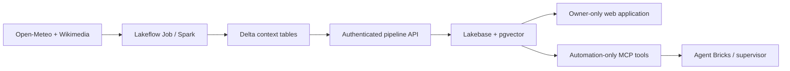

# Databricks AI Bootcamp Portfolio

[](https://github.com/gfonesl/databricks-ai-bootcamp/actions/workflows/ci.yml)

Production-minded data and AI projects built with Databricks Apps, Lakebase PostgreSQL, pgvector, Spark, and MCP. The portfolio focuses on deployable products: transactional applications, grounded retrieval, automated data pipelines, agent tools, access control, and reproducible verification.

## Featured project: Tripwise

[Tripwise AI Travel Planner](capstone/tripwise-capstone/README.md) is a restricted weather-aware planning demo. A daily Spark job collects destination context, Delta preserves the analytical pipeline output, Lakebase stores operational and vector state, and a FastMCP 3 server exposes six stable tools to an authorized automation identity.



The trust boundary is explicit: Databricks authenticates callers, Tripwise authorizes the forwarded subject as either `owner` or `automation`, and Lakebase credentials remain short-lived runtime values.

## Projects

| Project | Demonstrates | Stack |
| --- | --- | --- |
| [Day 1 — Support Operations](homeworks/day-1-lakebase-support-app/README.md) | Transactional ticket CRUD, relational messages, filtering, statistics, accessible UI, and browser smoke tests. | React, TypeScript, AppKit, Express, Lakebase |
| [Day 2 — Weather Intelligence](homeworks/day-2-weather-intelligence/README_WEATHER.md) | Public weather ingestion, content-aware upserts, deterministic chunking, embeddings, and semantic search. | Flask, NWS, psycopg2, pgvector |
| [Day 3 — Weather MCP Agent](homeworks/day-3-weather-mcp-agent/README_DAY3.md) | FastMCP 3 Streamable HTTP tools, deterministic travel guidance, and non-sensitive Lakebase telemetry. | FastMCP, FastAPI, Flask, Open-Meteo, Lakebase |
| [Tripwise — Capstone](capstone/tripwise-capstone/README.md) | Restricted full-stack data and agent application with atomic state replacement and authenticated pipeline/MCP integration. | FastAPI, Spark, Delta, Lakebase, pgvector, FastMCP 3 |

## Engineering standards

- Runtime and development dependencies are separated. Python lockfiles are fully pinned with artifact hashes; Node uses `npm ci`.
- CI runs Ruff, all four Python test suites, lockfile audits, Node typecheck/lint/format/build, browser smoke tests, and `npm audit`.
- Secrets, tokens, database passwords, workspace identifiers, generated bundles, and local tool state are excluded from source control.
- Tripwise fails closed when its identity allowlists are missing, validates pipeline provenance and size limits, and exposes separate liveness and readiness endpoints.
- Portfolio evidence is published only when it comes from a real run. No simulated screenshots are used.

See [SECURITY.md](SECURITY.md) for trust boundaries, secret handling, and vulnerability reporting.

## Reproduce local verification

Install Python development tools from the deterministic lockfile, then run the same checks used by CI:

```bash
python -m pip install --require-hashes -r requirements-dev.txt
ruff check .
ruff format --check .
```

Each Python project has an independent runtime lockfile and test suite. For example:

```bash
cd capstone/tripwise-capstone
python -m pip install --require-hashes -r requirements.txt
TRIPWISE_AUTH_MODE=disabled TRIPWISE_SKIP_SCHEMA_INIT=1 python -m pytest tests -q
```

PowerShell equivalent:

```powershell
$env:TRIPWISE_AUTH_MODE = "disabled"
$env:TRIPWISE_SKIP_SCHEMA_INIT = "1"
python -m pytest tests -q
```

Day 1 verification is platform-independent:

```bash
cd homeworks/day-1-lakebase-support-app
npm ci
npm run typecheck
npm run lint
npm run format
npm run build
npm test
npm audit --audit-level=low
```

Tests use fakes or browser request interception and do not require production secrets. Operational calls still require the Databricks/Lakebase runtime described in each project README.

## Release checklist

Before deployment, review the relevant bundle variables, supply resource names and identity subjects outside source control, and run `databricks bundle validate --strict`. Deployment and workspace integration tests are intentionally outside local CI because they require an authorized Databricks workspace.
