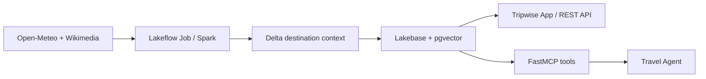

# Databricks AI Bootcamp Portfolio

Hands-on projects built with Databricks Apps, Lakebase PostgreSQL, pgvector, Spark, and MCP. Each project is a small, deployable product rather than a notebook-only exercise.

## Featured project — Tripwise

[**Tripwise AI Travel Planner**](capstone/tripwise-capstone/README.md) is the capstone: a weather-aware travel planner that combines a daily Spark pipeline, Delta Lake, Lakebase operational storage, semantic retrieval, and a FastMCP server that an agent can use to update an itinerary.



## Projects

| Project | What it demonstrates | Stack |
| --- | --- | --- |
| [Day 1 — Support Operations](homeworks/day-1-lakebase-support-app/README.md) | Transactional CRUD with relationships, validation, filtering, statistics, and persistence. | React, AppKit, Express, Lakebase |
| [Day 2 — Weather Intelligence](homeworks/day-2-weather-intelligence/README_WEATHER.md) | Ingesting public weather narratives, content-aware upserts, embeddings, and semantic search. | Flask, NWS, psycopg2, pgvector |
| [Tripwise — Capstone](capstone/tripwise-capstone/README.md) | A full data-and-agent application: Spark/Delta pipeline, operational App, semantic retrieval, and MCP write tools. | FastAPI, Spark, Delta, Lakebase, pgvector, FastMCP |

## Engineering principles

- **Security by design:** secrets are injected at runtime through Databricks; no passwords, tokens, or connection strings are committed.
- **Operational data belongs in Lakebase:** relational state and vector retrieval use PostgreSQL/pgvector; analytical pipeline outputs live in Delta.
- **Reproducible deployments:** each deployable project contains a Databricks Asset Bundle. Public configuration files use placeholders; supply your own resource names at deploy time.
- **Evidence before claims:** APIs validate inputs, repositories enforce foreign keys, and projects include focused automated tests.

## Run a project locally

Each project contains its own dependencies and instructions. For example:

```powershell
cd capstone/tripwise-capstone
python -m venv .venv
.\.venv\Scripts\Activate.ps1
pip install -r requirements.txt
pytest -q
```

The web applications require Lakebase credentials injected by Databricks for operational requests. Do not add production credentials to `.env` or to Git.

## Deploy safely

The bundle files intentionally contain no personal workspace identifiers. Pass your values at deployment time, for example:

```powershell
databricks bundle validate --profile <PROFILE> --var postgres_branch=<LAKEBASE_BRANCH> --var postgres_database=<LAKEBASE_DATABASE>
```

See each project README for the complete variables and deployment flow.

## Repository hygiene

This public repository excludes local agent tooling, Databricks workspace state, test caches, `.env` files, and submission ZIPs. The source code is intentionally kept separate from any runtime workspace, secret scope, service principal, or user data.
