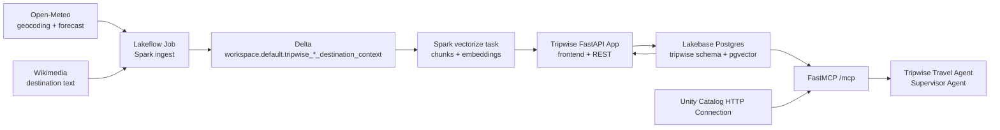

# Tripwise — AI Travel & Outdoor Activity Planner

Tripwise is the capstone project for the Databricks AI Bootcamp. It turns live destination context into weather-aware trips through a FastAPI Databricks App, a daily Spark pipeline, Lakebase/Postgres with pgvector, and a Supervisor Agent that can retrieve evidence and change an itinerary.

## Why this satisfies the capstone

- **Spark pipeline:** `jobs/tripwise_pipeline.py` collects and normalizes destination context every day into Delta tables.
- **Third-party APIs:** Open-Meteo supplies geocoding and 7-day forecasts; Wikimedia supplies unstructured destination descriptions. Neither needs an API key for this educational use.
- **Unstructured retrieval:** weather narratives and Wikimedia text are chunked at 800 characters with 100-character overlap and embedded using `sentence-transformers/all-MiniLM-L6-v2` (384 dimensions). `tripwise.knowledge_embeddings` has a cosine HNSW index.
- **Databricks App:** one FastAPI process serves the responsive frontend, REST API, and MCP endpoint.
- **AI agent actions:** MCP tools can retrieve context, create trips, add/move itinerary items, and build a persisted packing list.

## Architecture



## Lakebase data model

`users → trips → destinations → weather_snapshots` holds the operational travel state. `itinerary_items` and `packing_items` are persistent agent-write targets. `activities` supports reusable destination activities. `knowledge_documents` stores normalized source text and its `content_hash`; `knowledge_embeddings` stores each `vector(384)` chunk and points back to its document. Foreign keys protect relational integrity, while the HNSW index accelerates cosine semantic retrieval.

The App service principal initializes and owns the dedicated `tripwise` schema on its first deployment. It obtains short-lived Lakebase OAuth database credentials from the Databricks environment—there is no database password in this repository.

## Pipeline

The DAB defines the **Tripwise daily destination context** job, scheduled at 07:00 `America/Sao_Paulo` (initially paused so the first run can be verified manually).

1. `ingest_destination_context` uses Spark and calls Open-Meteo/Wikimedia for Rio de Janeiro, Chicago, and Paris. It writes raw payloads to `workspace.default.tripwise_raw_destination_context` and normalized records to `workspace.default.tripwise_destination_context`.
2. `vectorize_context` reads the normalized Delta table and chunks text. Because this workspace permits only serverless Jobs and its Python 3.12 image cannot reliably load the native PostgreSQL drivers or the sentence-transformers runtime, the task exchanges the Tripwise pipeline service principal's secret (read at runtime from a Databricks secret scope) for a short-lived OAuth token and sends the small prepared batch to the private App API. The App process loads the 384-dimensional embedding model once, then its Lakebase repository performs idempotent document and pgvector writes with `psycopg2`. Spark JDBC is intentionally not used anywhere for Lakebase writes.

The public-source context changes frequently; forecasts are live and limited to the provider’s horizon. The UI’s **Refresh weather** action updates operational weather snapshots for a saved trip independently of the daily context job.

## REST API

| Method | Route | Purpose |
|---|---|---|
| GET | `/healthz` | Health probe |
| GET/POST | `/api/trips` | List or create a trip |
| GET | `/api/trips/{trip_id}` | Full operational trip context |
| POST | `/api/trips/{trip_id}/destinations` | Resolve and add a destination |
| POST | `/api/trips/{trip_id}/sync-weather` | Refresh forecast snapshots |
| POST | `/api/trips/{trip_id}/itinerary` | Add itinerary item |
| PATCH/DELETE | `/api/itinerary-items/{id}` | Move or remove an item |
| POST | `/api/trips/{trip_id}/packing-list` | Persist weather-based packing recommendations |
| POST | `/api/search-context` | Semantic pgvector search |

## MCP contract

The App co-hosts Streamable HTTP at `/mcp`.

- `search_destination_context(query, trip_id?)`
- `get_trip_context(trip_id)`
- `create_trip(display_name, title, start_date, end_date, interests?, notes?)`
- `add_itinerary_item(trip_id, title, scheduled_date, destination_id?, start_time?, notes?, is_outdoor?)`
- `reschedule_itinerary_item(itinerary_item_id, scheduled_date, start_time?)`
- `build_packing_list(trip_id)`

Packing rules are deterministic and visible: rain probability ≥40% suggests rain protection; low ≤15°C adds a warm layer; high ≥30°C adds sunscreen/water; wind ≥40 km/h adds a wind-resistant outer layer. These are planning suggestions, not official safety advice.

## Run locally

```powershell
cd C:\Users\gabri\Projetos\databricks-ai-bootcamp\capstone\tripwise-capstone
python -m venv .venv
.\.venv\Scripts\Activate.ps1
pip install -r requirements.txt
pytest -q
```

The browser UI can run locally without a database only after setting `TRIPWISE_SKIP_SCHEMA_INIT=1`, but operational API calls need Lakebase environment variables injected by Databricks. Deploy the App first so its service principal creates the schema.

## Deploy and operate

```powershell
databricks bundle validate --strict --profile BOOTCAMP
databricks apps deploy --target default --profile BOOTCAMP
databricks bundle deploy --profile BOOTCAMP
databricks bundle run tripwise_daily_context --profile BOOTCAMP
```

After the first successful manual run, set the job schedule to `UNPAUSED`. Validate `/healthz`, create a trip, add a destination, refresh weather, run a semantic search, then confirm the same items remain after refreshing the App.

## Agent Bricks setup

The directory `agent/` is intentionally safe to commit: it contains instructions and templates, never OAuth values.

1. Create workspace service principal `tripwise-agent-client` and add it to the workspace.
2. Create secret scope `tripwise-agent-secrets`.
3. In the Databricks Account Console, create an OAuth secret for that SP and save it directly under `agent-oauth-client-secret`. The scheduled Job uses the same secret only through the secret scope to authenticate to the App; it is never sent through chat or saved to a file.
4. Create the UC HTTP connection from `agent/create_uc_connection.sql`, replacing only public placeholders. Grant the new agent `USE CONNECTION`.
5. Create the Supervisor Agent named **Tripwise Travel Agent**, use `agent/system_prompt.md`, attach the connection as a `uc_connection` tool and add the examples in `agent/evaluation_questions.md`.

Current deployment status: the Agent, UC connection and all six MCP tools are configured. The MCP session, semantic search and persisted `create_trip` write have been validated. The workspace currently blocks the Databricks-managed `qwen3-embedding-0-6b` capability with `MODEL_DISABLED`, so Agent Bricks examples and complete managed chat responses remain unavailable until that workspace capability is enabled.

## Limitations and next improvements

- Public forecasts and Wikimedia content can be unavailable or change between runs; the UI labels its source and refresh behaviour rather than claiming permanence.
- The default Spark pipeline seeds three destinations. A next version would derive pipeline destinations from saved trips and add source freshness monitoring.
- Packing advice is deterministic and is not a substitute for official weather, health, or travel safety guidance.
- Embedding runs use a compact general-purpose model. A destination-domain model and automated evaluation set would improve retrieval quality.
- The screenshot files required by a submission portal are intentionally not fabricated. Capture the live App, Job, Lakebase and Agent configuration after any final workspace-policy change, then place them in `evidence/` before zipping.
