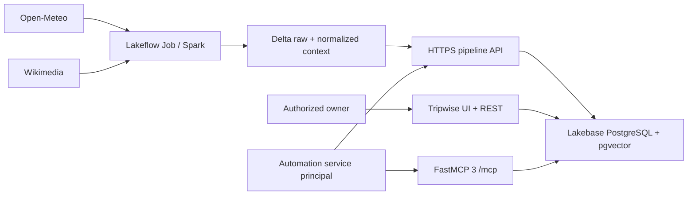

# Tripwise — Restricted AI Travel Planner

Tripwise is a weather-aware travel planning demonstration built as a Databricks App. It combines a daily Spark pipeline, Delta tables, Lakebase PostgreSQL with pgvector, a browser application, and six FastMCP 3 tools that can persist itinerary changes.

This is intentionally a restricted portfolio demo, not a multi-user travel product. One owner operates the UI and REST API; one automation service principal runs the pipeline and MCP integration.

## Architecture and trust boundaries



Databricks authenticates requests and supplies `X-Forwarded-User`. The App maps that immutable subject to one of two allowlists:

| Surface | Required role |
| --- | --- |
| UI and regular `/api/*` routes | `owner` |
| `/api/pipeline/context` | `automation` |
| `/mcp` | `automation` |
| `/healthz` and `/readyz` | Probe access, no application role |

Missing identity returns `401`; an authenticated subject without the required role receives `403`. Missing allowlist configuration stops startup. `TRIPWISE_AUTH_MODE=disabled` exists only for local tests and development; the bundle always deploys `enforce`.

The bundle grants `CAN_USE` only to the configured owner user and automation service principal. It stores subjects and resource names as non-secret variables. OAuth secrets remain secret-scope references and Lakebase passwords are short-lived runtime credentials.

## Reliability model

- `/healthz` is a process liveness check and does not query Lakebase.
- `/readyz` verifies the Tripwise schema in Lakebase and returns `503` when it is unavailable.
- Schema initialization is fail-fast outside explicitly skipped local tests.
- A destination row is locked while its complete forecast snapshot is replaced, preventing old forecast rows from leaking into the UI or packing rules.
- Generated packing items are replaced in one transaction, including removal of recommendations that no longer apply.
- Weather documents use a stable per-destination ID. Superseded weather documents and cascading embeddings are deleted after an accepted update.
- Pipeline ingestion refuses partial required-city batches before either Delta table is overwritten. Each bundle task has two retries with a minimum 60-second interval.

## Pipeline provenance controls

The vectorization task accepts only an HTTPS root URL on a Databricks Apps domain. The receiving endpoint permits at most 12 documents, 20 chunks per document, and 250 KB of validated JSON.

`source_type` is restricted to `weather_forecast` or `destination_summary`; document IDs must use the corresponding `open-meteo:` or `wikimedia:` namespace. The App recalculates a canonical SHA-256 hash from the headline and narrative and rejects tampered content before persistence. Request logs contain actor, request ID, method, route, status, and duration, never bearer tokens or document content.

Browser responses add a restrictive Content Security Policy, `X-Content-Type-Options`, `Referrer-Policy`, and `Permissions-Policy`. The App does not enable cross-origin access.

## Data design

`users → trips → destinations → weather_snapshots` represents operational travel state. `itinerary_items` and generated `packing_items` are persistent action targets. `knowledge_documents` stores normalized public-source text and its content hash; `knowledge_embeddings` stores 384-dimensional chunks with a cosine HNSW index.

The embedding runtime uses `sentence-transformers==5.7.0` and pins `sentence-transformers/all-MiniLM-L6-v2` to revision `1110a243fdf4706b3f48f1d95db1a4f5529b4d41`.

## Public HTTP interfaces

| Method | Route | Purpose |
| --- | --- | --- |
| GET | `/healthz` | Process liveness |
| GET | `/readyz` | Lakebase/schema readiness |
| GET/POST | `/api/trips` | List or create trips |
| GET | `/api/trips/{trip_id}` | Read full trip context |
| POST | `/api/trips/{trip_id}/destinations` | Resolve and add a destination |
| POST | `/api/trips/{trip_id}/sync-weather` | Atomically refresh each destination forecast |
| POST | `/api/trips/{trip_id}/itinerary` | Add an itinerary item |
| PATCH/DELETE | `/api/itinerary-items/{id}` | Reschedule or remove an item |
| POST | `/api/trips/{trip_id}/packing-list` | Replace the generated packing list |
| POST | `/api/search-context` | Semantic destination search |
| POST | `/api/pipeline/context` | Validated automation-only context persistence |

## Stable MCP interface

The authenticated Streamable HTTP endpoint remains `/mcp`. FastMCP was migrated to `3.4.7` without changing the six tool names or parameters:

- `search_destination_context(query, trip_id?)`
- `get_trip_context(trip_id)`
- `create_trip(display_name, title, start_date, end_date, interests?, notes?)`
- `add_itinerary_item(trip_id, title, scheduled_date, destination_id?, start_time?, notes?, is_outdoor?)`
- `reschedule_itinerary_item(itinerary_item_id, scheduled_date, start_time?)`
- `build_packing_list(trip_id)`

Packing rules are deterministic: precipitation probability at least 40% suggests rain protection; low temperature at most 15°C adds a warm layer; high temperature at least 30°C adds sunscreen and water; wind at least 40 km/h adds a wind-resistant layer. These are planning suggestions, not official safety advice.

## Reproducible local verification

Runtime dependencies are declared in `requirements.in` and compiled into a fully pinned `requirements.txt` with artifact hashes. Development tools are locked separately at repository root.

```bash
python -m pip install --require-hashes -r requirements.txt
python -m pip install --require-hashes -r ../../requirements-dev.txt
TRIPWISE_AUTH_MODE=disabled TRIPWISE_SKIP_SCHEMA_INIT=1 python -m pytest tests -q
```

PowerShell:

```powershell
$env:TRIPWISE_AUTH_MODE = "disabled"
$env:TRIPWISE_SKIP_SCHEMA_INIT = "1"
python -m pytest tests -q
```

The suite covers identity roles, authenticated MCP handshake and discovery, liveness/readiness, fail-fast startup, payload provenance and limits, stable weather IDs, pipeline partial failure, and transactional forecast/packing replacement. CI also runs Ruff and `pip-audit` against the lockfile.

## Bundle validation and deployment

Supply real resource names and subjects at release time; do not commit them:

```bash
databricks bundle validate --strict \
  --var postgres_branch=<LAKEBASE_BRANCH> \
  --var postgres_database=<LAKEBASE_DATABASE> \
  --var lakebase_endpoint=<LAKEBASE_ENDPOINT> \
  --var pipeline_api_url=https://<app-host>.databricksapps.com \
  --var pipeline_oauth_client_id=<CLIENT_ID> \
  --var pipeline_oauth_secret_scope=<SECRET_SCOPE> \
  --var pipeline_oauth_secret_key=<SECRET_KEY> \
  --var owner_user_name=<OWNER_USER_NAME> \
  --var owner_subject=<OWNER_FORWARDED_SUBJECT> \
  --var automation_service_principal_name=<SERVICE_PRINCIPAL_APPLICATION_ID> \
  --var automation_subject=<AUTOMATION_FORWARDED_SUBJECT>
```

Deployment and workspace integration tests are deliberately outside this local change. The [evidence index](evidence/README.md) defines the real screenshots and metadata required before publishing workspace claims.

## Limitations

- Public forecasts and Wikimedia summaries can change or be temporarily unavailable.
- The pipeline currently uses three required demonstration destinations instead of deriving active destinations from trips.
- The owner/automation model is suitable for a restricted demo, not customer isolation or delegated multi-user authorization.
- Packing guidance does not replace official weather, health, or travel safety advice.
- Agent Bricks behavior, App permissions, OAuth forwarding, and Lakebase availability still require validation in the target workspace after deployment.
