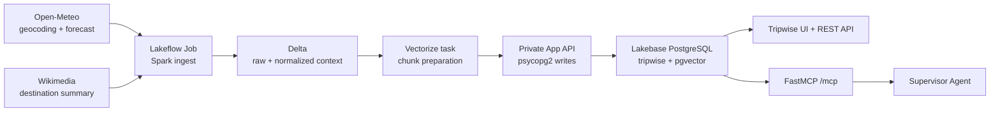

# Tripwise — AI Travel Planner

Tripwise is a weather-aware travel planner built as a Databricks App. It turns public destination data into a durable trip plan through a FastAPI application, a daily Spark pipeline, Lakebase PostgreSQL with pgvector, and FastMCP tools that an AI agent can use safely.

## What it demonstrates

- **Data pipeline:** a Lakeflow Job fetches public destination context every day and writes raw and normalized Delta tables.
- **Semantic retrieval:** public weather narratives and Wikimedia summaries are chunked into 800-character windows with 100-character overlap, embedded with `sentence-transformers/all-MiniLM-L6-v2` (384 dimensions), and indexed in Lakebase with HNSW cosine search.
- **Operational application:** the App stores users, trips, destinations, activities, itinerary items, weather snapshots, packing items, and knowledge documents in a dedicated relational schema.
- **Agent-ready actions:** FastMCP tools retrieve grounded context and create or update persistent travel plans with validated inputs.

## Architecture



## Data design

`users → trips → destinations → weather_snapshots` represents the operational travel state. `itinerary_items` and `packing_items` are durable targets for App and agent actions. `knowledge_documents` stores normalized source text plus a `content_hash`; `knowledge_embeddings` stores its `vector(384)` chunks with a cosine HNSW index.

The App service principal creates and owns the `tripwise` schema on first deployment. Lakebase access uses short-lived credentials supplied by Databricks at runtime; this repository never contains a database password.

## Pipeline

The bundle defines **Tripwise daily destination context**, scheduled for 07:00 `America/Sao_Paulo` and initially paused for manual verification.

1. `ingest_destination_context` calls Open-Meteo and Wikimedia for Rio de Janeiro, Chicago, and Paris. It writes raw records to `workspace.default.tripwise_raw_destination_context` and normalized records to `workspace.default.tripwise_destination_context`.
2. `vectorize_context` reads normalized Delta data and prepares text chunks. It exchanges a secret-reference-backed OAuth credential for a temporary token and sends the small batch to the App’s internal pipeline endpoint.
3. The App loads the embedding model once per process and writes documents and pgvector embeddings transactionally with `psycopg2`. Spark JDBC is intentionally not used for Lakebase writes.

## REST API

| Method | Route | Purpose |
| --- | --- | --- |
| GET | `/healthz` | Health probe |
| GET/POST | `/api/trips` | List or create trips |
| GET | `/api/trips/{trip_id}` | Read full trip context |
| POST | `/api/trips/{trip_id}/destinations` | Resolve and add a destination |
| POST | `/api/trips/{trip_id}/sync-weather` | Refresh forecast snapshots |
| POST | `/api/trips/{trip_id}/itinerary` | Add an itinerary item |
| PATCH/DELETE | `/api/itinerary-items/{id}` | Reschedule or remove an item |
| POST | `/api/trips/{trip_id}/packing-list` | Build a persistent packing list |
| POST | `/api/search-context` | Search destination context semantically |

## MCP tools

The App co-hosts Streamable HTTP at `/mcp`.

- `search_destination_context(query, trip_id?)`
- `get_trip_context(trip_id)`
- `create_trip(display_name, title, start_date, end_date, interests?, notes?)`
- `add_itinerary_item(trip_id, title, scheduled_date, destination_id?, start_time?, notes?, is_outdoor?)`
- `reschedule_itinerary_item(itinerary_item_id, scheduled_date, start_time?)`
- `build_packing_list(trip_id)`

Packing rules are deterministic and inspectable: precipitation probability ≥40% suggests rain protection; low temperature ≤15°C adds a warm layer; high temperature ≥30°C adds sunscreen and water; wind ≥40 km/h adds a wind-resistant outer layer. These are planning suggestions, not official safety advice.

## Local verification

```powershell
cd capstone/tripwise-capstone
python -m venv .venv
.\.venv\Scripts\Activate.ps1
pip install -r requirements.txt
pytest -q
```

The UI can start locally with `TRIPWISE_SKIP_SCHEMA_INIT=1`, but operational routes require Lakebase runtime variables injected by Databricks.

## Deployment

This repository uses generic templates so it can be safely shared. Provide your own values when validating or deploying:

```powershell
databricks bundle validate --strict --profile <PROFILE> `
  --var postgres_branch=<LAKEBASE_BRANCH> `
  --var postgres_database=<LAKEBASE_DATABASE> `
  --var lakebase_endpoint=<LAKEBASE_ENDPOINT> `
  --var pipeline_api_url=https://<app-host> `
  --var pipeline_oauth_client_id=<CLIENT_ID> `
  --var pipeline_oauth_secret_scope=<SECRET_SCOPE> `
  --var pipeline_oauth_secret_key=<SECRET_KEY>

databricks bundle deploy --profile <PROFILE> <same variables>
```

For the agent connection, copy the placeholder values into [`agent/create_uc_connection.sql`](agent/create_uc_connection.sql). Create the OAuth secret directly in a Databricks secret scope; never place its value in a file, shell history, screenshot, or commit.

## Limitations and next steps

- Public forecasts and Wikimedia summaries are live data and can change or become temporarily unavailable.
- The initial pipeline uses three destinations; a production version would derive destinations from active trips and add freshness monitoring.
- Packing advice is deterministic and is not a substitute for official weather, health, or travel safety guidance.
- A domain-specific embedding model and automated retrieval/action evaluations would improve quality over time.
