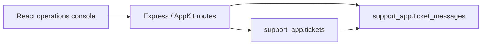

# Support Operations Console

A Databricks App for managing operational support tickets and their conversation history in Lakebase PostgreSQL. The project demonstrates a typed React interface, an Express/AppKit backend, relational persistence, input validation, and a reproducible browser smoke test.

## Product flow

Operators can filter the ticket queue, inspect status and priority, read message history, create tickets, append messages, and update status. Summary cards expose queue totals by status. The UI uses semantic headings and labeled controls so the main workflow remains keyboard- and screen-reader-friendly.



## Data and safety

- The App owns a dedicated `support_app` schema instead of relying on public tables.
- Route handlers validate enums, lengths, identifiers, and state transitions before executing parameterized SQL.
- Messages reference tickets through a foreign key, and database writes use transactions.
- Lakebase credentials are supplied by the Databricks runtime. Do not commit tokens or passwords to `.env`.
- Browser tests intercept API calls and use deterministic fixtures; screenshots or workspace claims are not simulated for portfolio evidence.

## Local development

Requirements: Node.js 22 and npm. Databricks CLI authentication and Lakebase configuration are needed only for live backend operations.

```bash
npm ci
npm run dev
```

Copy `.env.example` to `.env` only when exercising the live AppKit backend, and keep that file local. OAuth is preferred over long-lived personal access tokens.

The npm scripts use `cross-env` and `rimraf`, so start, development, and clean commands work on Windows and Unix-like systems.

## Verification

```bash
npm run typecheck
npm run lint
npm run format
npm run build
npm test
npm audit --audit-level=low
```

`npm test` runs Vitest and two Playwright smoke scenarios. The smoke server builds and previews the production client without contacting Databricks; API requests are intercepted in the browser. Live Lakebase integration remains a deployment verification step.

## Deployment

The bundle accepts Lakebase project, branch, and database resource names as variables. Validate with non-secret resource identifiers supplied at runtime:

```bash
databricks bundle validate --strict \
  --var postgres_project=<LAKEBASE_PROJECT> \
  --var postgres_branch=<LAKEBASE_BRANCH> \
  --var postgres_database=<LAKEBASE_DATABASE>
```

Deploy only from an authenticated environment after reviewing the generated plan. No workspace host or user identifier is committed in the bundle.

## Structure

```text
client/             React, TypeScript, AppKit UI
server/             Express entry point and Lakebase routes
shared/             Generated AppKit types
tests/              Playwright smoke coverage
databricks.yml      Parameterized Asset Bundle
app.yaml            Databricks App process definition
```

The package is MIT licensed. Direct dependencies are pinned in `package.json`, the full graph is locked by `package-lock.json`, and CI installs it with `npm ci`.
