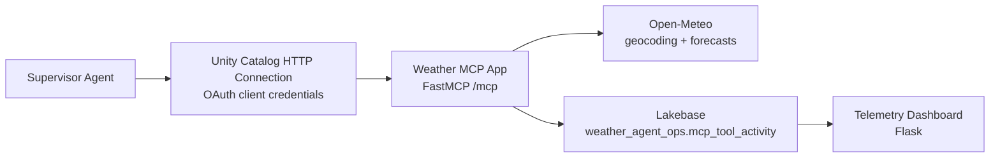

# Homework 3 — Weather MCP Server and Agent

This project exposes live weather data as safe, inspectable MCP tools. It contains two independently deployable Databricks Apps: a FastMCP server that records non-sensitive tool telemetry in Lakebase, and a Flask dashboard that visualizes that telemetry.

## Architecture



Open-Meteo is the public source: it requires no API key, resolves global city names, and returns live metric forecasts. Live data can change between calls and is not an authoritative severe-weather alert service.

## MCP tools

| Tool | Purpose |
| --- | --- |
| `get_current_weather(location)` | Current temperature, feels-like temperature, humidity, wind, and condition. |
| `get_weather_forecast(location, days)` | One to seven daily forecasts with high/low, precipitation probability, rain, wind, and condition. |
| `get_travel_recommendation(location, date)` | Transparent packing guidance for a `YYYY-MM-DD` date within the next seven days. |

The recommendation is deterministic and exposes its evidence: precipitation probability ≥40% suggests an umbrella; minimum temperature ≤15°C suggests a jacket; maximum temperature ≥30°C suggests heat preparation; wind ≥40 km/h adds a wind caution.

## Lakebase telemetry

The MCP App creates and owns `weather_agent_ops.mcp_tool_activity`. It records tool name, location, requested date/days, a short operational summary, outcome, and timestamp—never OAuth tokens, request headers, raw secrets, or agent chat transcripts. The dashboard is granted read-only access after deployment.

Both Apps request temporary Lakebase OAuth credentials at runtime via the Databricks SDK and use `psycopg2`; no database password is committed or supplied by the browser.

## Deploy and configure

1. Configure a local Databricks CLI profile and deploy `mcp_server` first. Its App service principal initializes the Lakebase schema.
2. Deploy `dashboard`, then grant its service principal read-only access:

   ```sql
   GRANT USAGE ON SCHEMA weather_agent_ops TO "<DASHBOARD_APP_SERVICE_PRINCIPAL_CLIENT_ID>";
   GRANT SELECT ON weather_agent_ops.mcp_tool_activity TO "<DASHBOARD_APP_SERVICE_PRINCIPAL_CLIENT_ID>";
   ```

3. Create a dedicated MCP client service principal and secret scope. Follow [`agent/CREATE_OAUTH_SECRET.md`](agent/CREATE_OAUTH_SECRET.md); the secret value must remain in Databricks only.
4. Replace placeholders in [`agent/create_uc_connection.sql`](agent/create_uc_connection.sql), execute it through a SQL Warehouse, and create the UC connection.
5. Create a Supervisor Agent using [`agent/system_prompt.md`](agent/system_prompt.md), grant its service principal `USE CONNECTION` on `weather_mcp_connection`, attach the UC connection as an `uc_connection` tool, and add the prompts from `agent/evaluation_questions.md` as examples.

Use your own Lakebase resource values when validating a Bundle:

```powershell
databricks bundle validate --strict --profile <PROFILE> `
  --var postgres_branch=<LAKEBASE_BRANCH> `
  --var postgres_database=<LAKEBASE_DATABASE>
```

## Local checks

Install each App's requirements independently, then run:

```text
cd mcp_server && python -m unittest discover -s tests
cd ../dashboard && python -m unittest discover -s tests
```

For a deployed server, test `GET /healthz`, discover `tools/list`, invoke all three tools, and then confirm that the dashboard receives the resulting activity. Test Agent Bricks with the questions in `agent/evaluation_questions.md` and retain screenshots outside the public source repository.

## Limitations and next steps

- Open-Meteo forecasts are live, may change, and are limited to the provider horizon.
- Ambiguous locations may need a state or country qualifier.
- A future version could add official NWS alerts for US locations, health monitoring, stronger geographic disambiguation, and a governed audit trail for conversations with explicit privacy approval.
